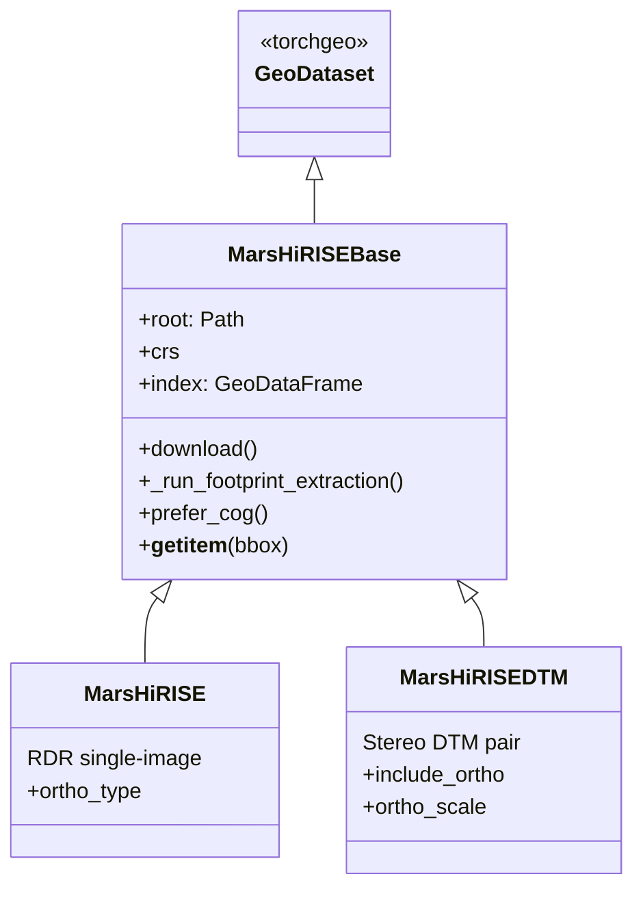

# Dataset layer

`src/dataset/core/base.py` defines `MarsHiRISEBase`, the abstract shared foundation. Both
`MarsHiRISE` (RDR) and `MarsHiRISEDTM` (stereo DTM) extend it.

## Class hierarchy

## Shared responsibilities (`MarsHiRISEBase`)

- **Async PDS index download** — `RDRCUMINDEX.TAB` / `DTMCUMINDEX.TAB` over `aiohttp`.
- **Raster-based footprint extraction** — `_run_footprint_extraction()` uses a
  `ProcessPoolExecutor` to read each raster's actual valid-pixel polygon (not just the
  bounding box).
- **Spatial index construction** → `self.index` (a GeoDataFrame with a
  `pd.IntervalIndex` datetime axis).
- **COG sidecar preference** — `prefer_cog()` swaps in the `.tif` sibling when present.
- **Global and regional coverage plots** — quick QC visualizations.

## `MarsHiRISEDTM` — primary training source

One row per stereo pair. Each row stores paths to:

| Field            | Format         | Notes                                |
|------------------|----------------|--------------------------------------|
| `dtm_path`       | `.IMG` float32 | 1 DN = 1 m elevation; NaN = nodata   |
| `left_red_path`  | JP2, 1 band    | RED orthoimage, calibrated I/F [0,1] |
| `right_red_path` | JP2, 1 band    | RED orthoimage, calibrated I/F [0,1] |
| `left_irb_path`  | JP2, 3 bands   | NIR / RED / BG                       |
| `right_irb_path` | JP2, 3 bands   | NIR / RED / BG                       |

`__getitem__` returns a dict with keys `{"elevation", "left_red", "right_red", "left_irb",
"right_irb", "bounds", "crs"}`. Elevation nodata is `NaN`; orthos are calibrated to I/F `[0, 1]`
via PDS3 `.LBL` scaling factors.

**Build-time validation:** pairs missing either L or R ortho are dropped; pairs whose ortho
footprint overlaps the DTM by <75 % are logged and dropped.

## API

- [`dataset.core.base`](../reference/dataset/core/base.md) — `MarsHiRISEBase`
- [`dataset.core.rdr`](../reference/dataset/core/rdr.md) — `MarsHiRISE`
- [`dataset.core.dtm`](../reference/dataset/core/dtm.md) — `MarsHiRISEDTM`
