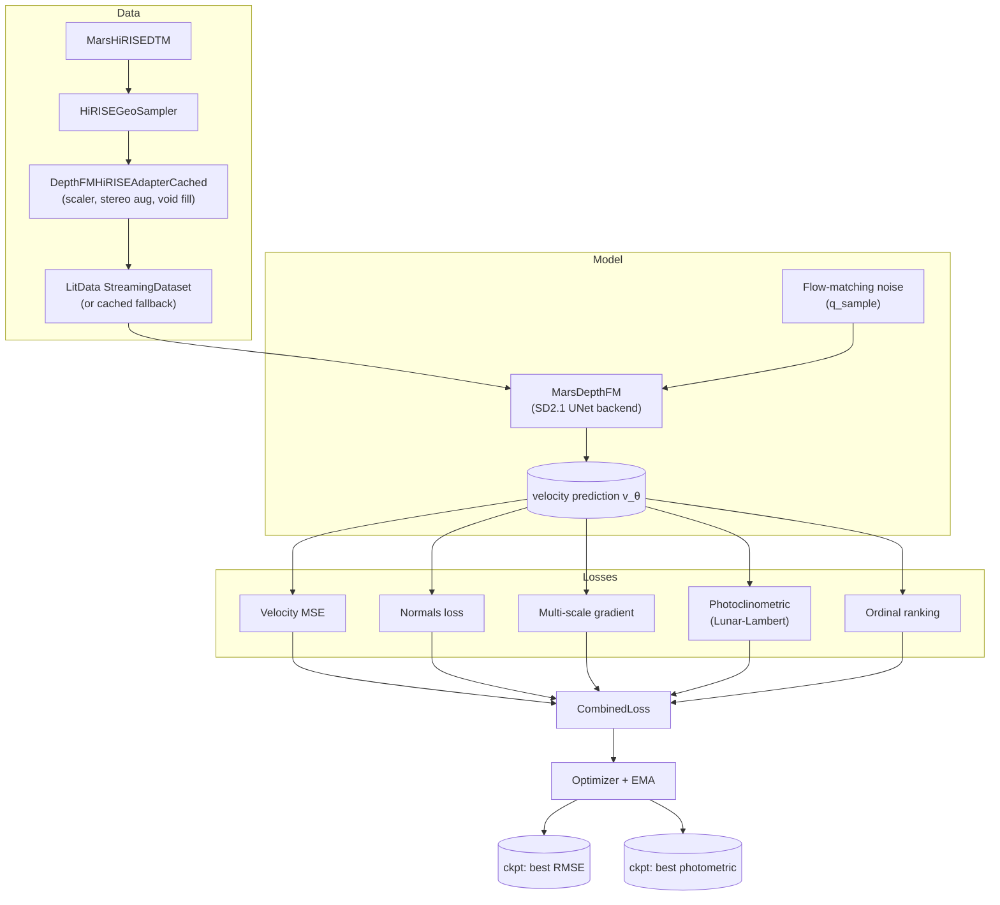

# DepthFM training pipeline

DepthFM is a flow-matching monocular depth estimator adapted for Mars DTMs.

## End-to-end flow



## Rendered pipeline (Graphviz)

CI renders three rich pipeline figures from
`scripts/architecture/depthfm_pipeline_diagram.py` — they embed real adapter outputs as image
nodes (GMRF fill, TIN/seam detection, sun-vector OLS, flow evolution, normals, FFT). When
present, they are written to:

- `docs/diagrams/pipeline_overview.svg`
- `docs/diagrams/adapter_detail.svg`
- `docs/diagrams/training_step.svg`

To produce them locally:

```bash
uv run python scripts/architecture/depthfm_pipeline_diagram.py
```

## Key files

| Concern                       | File                                        |
|-------------------------------|---------------------------------------------|
| Training entry point          | `src/depth_fm/training/train_lightning.py`  |
| Lightning loop / EMA / ckpt   | `src/depth_fm/training/lightning_module.py` |
| Model wrapper                 | `src/depth_fm/models/mars_depthfm.py`       |
| Flow-matching noise schedule  | `src/depth_fm/flow/noise.py`                |
| Combined loss                 | `src/depth_fm/objectives/losses.py`         |
| Metrics (RMSE, AbsRel, photo) | `src/depth_fm/objectives/metrics.py`        |
| Data adapter                  | `src/depth_fm/data/adapter.py`              |
| LitData streaming             | `src/depth_fm/data/datamodule.py`           |

## Dual-checkpoint strategy

The Lightning module tracks **two separate "best" checkpoints**:

1. Best validation **RMSE** — the standard depth metric.
2. Best **photometric consistency** — Lunar-Lambert rendering MSE against the orthoimage.

These often diverge because RMSE rewards mean correctness while photometric rewards local
surface-normal fidelity. Keeping both lets us pick the right model per downstream task.

## Round-robin figure distribution

Heavy validation viz (e.g. XGBoost failure prediction, residual analysis, Pareto plots) is
distributed round-robin across DDP ranks to avoid stalling rank 0. See
`src/depth_fm/viz/debug_viz.py`.
