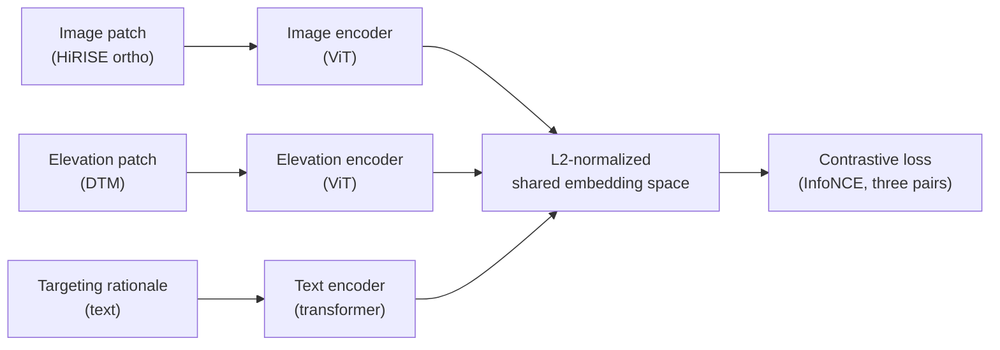

# MarsCLIP

MarsCLIP is a tri-modal contrastive model that aligns three views of the same Mars location:

- **Image** — HiRISE orthoimage patch
- **Elevation** — co-registered DTM patch
- **Text** — HiRISE targeting rationale / observation description

## Architecture sketch



## MAE pretraining

Before contrastive alignment, the image and elevation encoders are pretrained with a Masked
Autoencoder (`src/clip/marsclip_mae.py` + `train_marsclip_mae.py`). This bootstraps useful
features when paired text data is sparse.

## Key files

| Concern                         | File                                       |
|---------------------------------|--------------------------------------------|
| Model architecture              | `src/clip/marsclip_model.py`               |
| MAE pretraining                 | `src/clip/marsclip_mae.py`                 |
| Train MAE entry point           | `src/clip/train_marsclip_mae.py`           |
| Patch / observation manifests   | `src/clip/marsclip_patches.py`, `observation_manifest.py` |
| Text rationale extraction       | `src/clip/marsclip_text.py`, `rationale_cache.py` |
| Splits                          | `src/clip/marsclip_splits.py`              |
| Dataset                         | `src/clip/marsclip_dataset.py`             |
| Embedding reports               | `src/clip/report_marsclip_embeddings.py`   |

The architecture diagram script `scripts/architecture/marsclip_diagram.py` produces a
Graphviz figure that CI writes to `docs/diagrams/marsclip.svg`. To produce it locally:

```bash
uv run python scripts/architecture/marsclip_diagram.py
```
