# Overview

MarsRecon is split into three top-level Python packages under `src/`, plus an entry-point
`scripts/` tree.

## Top-level data flow

```mermaid
flowchart LR
    PDS["NASA PDS<br/>Imaging Node"]:::ext
    Index["RDRCUMINDEX.TAB<br/>DTMCUMINDEX.TAB"]
    Cache["Local cache<br/>(.gpkg index + JP2/IMG)"]
    COG["Cloud-Optimized<br/>GeoTIFF (.tif)"]
    LD["LitData chunks<br/>(binary, streaming)"]

    DS["MarsHiRISE / MarsHiRISEDTM<br/>(GeoDataset)"]
    SAM["HiRISEGeoSampler<br/>(strip-aware)"]
    AD["DepthFMHiRISEAdapterCached<br/>(normalization, stereo aug)"]

    LM["DepthFMLightningModule<br/>(flow matching)"]
    CK[("Checkpoints<br/>(best RMSE / photo)")]

    PDS -->|async download| Index --> Cache
    Cache -->|cog_conversion| COG
    Cache --> DS
    COG --> DS
    DS --> SAM --> AD
    AD --> LM
    AD -->|build_litdata.py| LD --> LM
    LM --> CK

    classDef ext fill:#fde,stroke:#a44;
```



## Source-tree map

```
src/
  dataset/                       # public API: MarsHiRISE, MarsHiRISEDTM, HiRISEGeoSampler
    core/
      base.py                    — MarsHiRISEBase: shared download, indexing, footprint, viz
      rdr.py                     — MarsHiRISE: RDR single-image dataset
      dtm.py                     — MarsHiRISEDTM: stereo DTM + orthoimage dataset
    sampling/
      sampler.py                 — HiRISEGeoSampler: strip-aware patch sampler with splits
      geometry.py                — Valid-center region + patch packing (optimal mode)
    preprocessing/
      cog_conversion.py          — JP2/IMG → Cloud-Optimized GeoTIFF
    stats/
      compute_stats.py           — Multi-GPU Welford accumulator over live GDAL reads
      compute_stats_litdata.py   — Fast NumPy path over pre-built LitData chunks
    validation/
      sampling_diagnostics.py    — Diagnostic PNGs for strip geometry, sampler coverage

  depth_fm/                      # public API: MarsDepthFM, DepthFMLightningModule
    models/
      mars_depthfm.py            — MarsDepthFM wrapper + build_model() + load_sd21_backend()
      experimental.py            — DebugUNet, ModulatedMicroFlowNet (optional backbones)
      unet/                      — CompVis LDM UNetModel (upstream, frozen)
    training/
      train_lightning.py         — Entry point: torchrun -m depth_fm.training.train_lightning
      lightning_module.py        — DepthFMLightningModule: train/val/test, EMA, dual ckpt
    data/
      adapter.py                 — DepthFMHiRISEAdapterCached: map-style wrapper
      datamodule.py              — Lightning DataModule + LitData StreamingDataset
      scalers.py                 — Elevation normalization strategies
      image_processing/          — mask_ops, void_filling, seam_detection, sun_vector, terrain
    objectives/
      losses.py                  — PhotoclinometricLoss, AbsoluteDepthLoss, Laplacian, ...
      metrics.py                 — DTMMetrics, affine_align, photo consistency
    flow/
      noise.py                   — Flow-matching noise schedule
    viz/
      train_viz.py               — Publication-quality figures
      debug_viz.py               — Training-side analysis viz

  clip/                          — Tri-modal CLIP model + MAE pretraining
```

## Where to look (routing table)

| Task                                      | File                                                   |
|-------------------------------------------|--------------------------------------------------------|
| Add/modify a loss                         | `src/depth_fm/objectives/losses.py`                    |
| Add/modify a metric                       | `src/depth_fm/objectives/metrics.py`                   |
| Change training loop / Lightning step     | `src/depth_fm/training/lightning_module.py`            |
| Change training entry point / CLI         | `src/depth_fm/training/train_lightning.py`             |
| Add/change a model backbone               | `src/depth_fm/models/mars_depthfm.py`                  |
| Change normalization strategy             | `src/depth_fm/data/scalers.py`                         |
| Change data adapter / GDAL reads          | `src/depth_fm/data/adapter.py`                         |
| Void filling (kriging / GMRF / diffusion) | `src/depth_fm/data/image_processing/void_filling.py`   |
| Seam / TIN artifact detection             | `src/depth_fm/data/image_processing/seam_detection.py` |
| Sun-vector estimation                     | `src/depth_fm/data/image_processing/sun_vector.py`     |
| Change LitData streaming                  | `src/depth_fm/data/datamodule.py`                      |
| Flow-matching noise schedule              | `src/depth_fm/flow/noise.py`                           |
| Training-side analysis viz                | `src/depth_fm/viz/debug_viz.py`                        |
| Publication figures                       | `src/depth_fm/viz/train_viz.py`                        |
| Change sampling / split logic             | `src/dataset/sampling/sampler.py`                      |
| Change DTM dataset semantics              | `src/dataset/core/dtm.py`                              |
| Change RDR dataset semantics              | `src/dataset/core/rdr.py`                              |
| Change PDS download / footprint           | `src/dataset/core/base.py`                             |
| JP2 → COG conversion                      | `src/dataset/preprocessing/cog_conversion.py`          |
