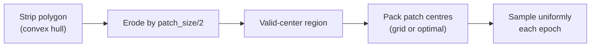

# Sampler

HiRISE strips are thin rotated parallelograms (a few km wide, tens of km long), so naive
bounding-box sampling wastes 60–90 % of patches on empty pixels. `HiRISEGeoSampler`
pre-computes a grid of patch centres that actually intersect each strip's convex-hull polygon
and samples uniformly from that set each epoch.

## Geometry idea



The "optimal" mode (in `src/dataset/sampling/geometry.py`) packs centres to maximize
non-overlapping coverage; "simple" mode uses a regular grid.

## Geographic splits

The sampler supports `train` / `val` / `test` splits via geographic partitioning:

- `split_method="geographic"` — split by `split_axis` (`"longitude"` or `"latitude"`).
- `split_fractions=(0.8, 0.1, 0.1)` — fractions of strips (not patches) per split.
- K-fold cross-validation is also supported via `n_folds` / `fold_idx`.

This prevents leakage from a strip's patches appearing in more than one split.

## Usage

```python
from dataset import HiRISEGeoSampler
from torchgeo.samplers import Units

sampler = HiRISEGeoSampler(
    dataset,
    size=0.018,                  # in CRS units
    length=None,                 # use the full prebuilt set
    units=Units.CRS,
    split_fractions=(0.8, 0.1, 0.1),
    split_method="geographic",
    split_axis="longitude",
    split="train",
)
```

See [`dataset.sampling.sampler`](../reference/dataset/sampling/sampler.md) and
[`dataset.sampling.geometry`](../reference/dataset/sampling/geometry.md).
