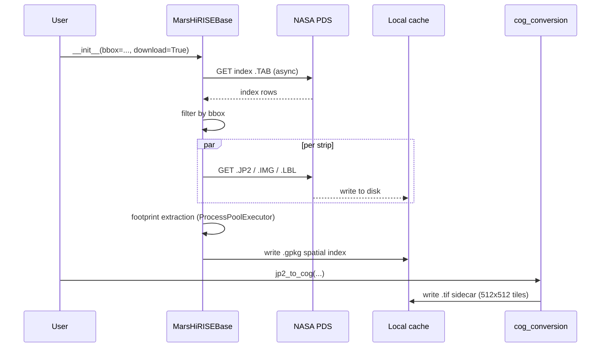

# Download & COG conversion

The first time you use a region, MarsRecon needs to:

1. Fetch the PDS cumulative index (`RDRCUMINDEX.TAB` / `DTMCUMINDEX.TAB`).
2. Identify the strips/pairs that intersect your bbox.
3. Download the JP2 / IMG / LBL files.
4. Compute per-raster valid-pixel footprints.
5. (Optional, recommended) convert JP2 → Cloud-Optimized GeoTIFF for fast random access.



## Download a bounded region

```bash
PYTHONPATH=src uv run python -m dataset.core.dtm \
    --bbox -120 -30 150 30 \
    --root /scratch/mars_hirise_dtm
```

!!! danger "Always pass a bbox or target"
The full DTM archive is >10 TB. Unfiltered downloads will exhaust disk before completing.

## Pre-convert to COG

JP2 random access is slow; COG is fast. Run this once per region:

```bash
PYTHONPATH=src uv run python -m dataset.preprocessing.cog_conversion \
    --root /scratch/mars_hirise_dtm \
    --workers 4
```

`prefer_cog()` on the dataset will then transparently pick the `.tif` sidecar when available.

See: [`dataset.core.base`](../reference/dataset/core/base.md),
[`dataset.preprocessing.cog_conversion`](../reference/dataset/preprocessing/cog_conversion.md).
