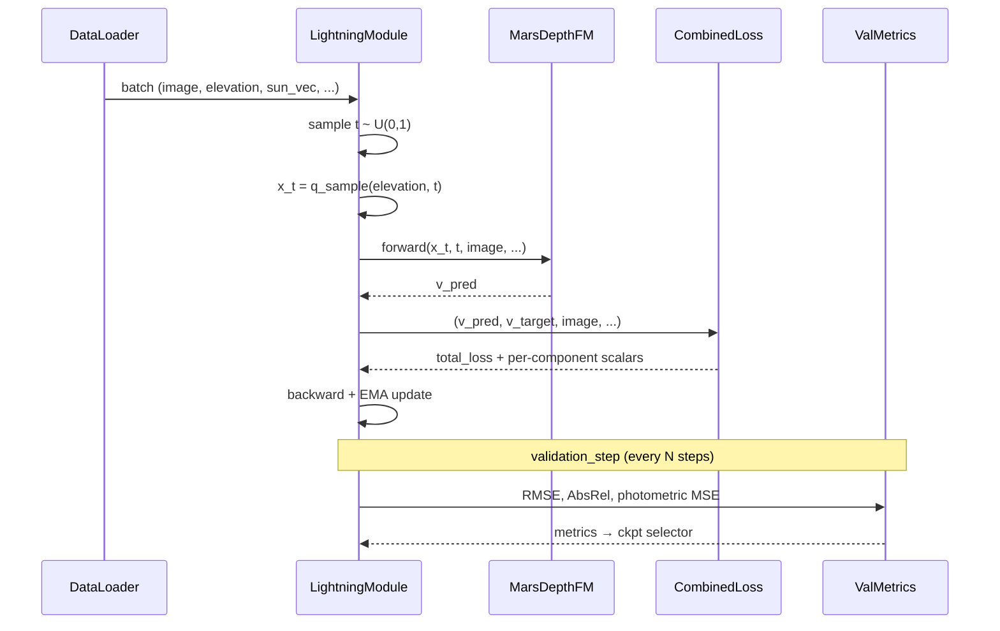

# Training

A typical 4×A6000 training run:

```bash
bash scripts/training/launch_train.sh \
    --config configs/train_hirise.yaml \
    --n_runs 1
```

`launch_train.sh` sets NCCL/CUDA environment variables and invokes
`torchrun -m depth_fm.training.train_lightning` with the right world size.

## Data-loading priority

`build_dataloaders()` in `src/depth_fm/training/train_lightning.py` picks the fastest available
source, in this order:

1. **LitData `StreamingDataset`** — pre-built binary chunks (fastest).
2. **`DepthFMHiRISEAdapterCached`** — live GDAL reads on COG sidecars (fallback).

If neither is available, the run fails early with a clear error.

## Train / val / test step



## OmegaConf overrides

```bash
bash scripts/training/launch_train.sh \
    training.per_gpu_batch_size=2 \
    training.max_steps=500 \
    losses.photometric_weight=0.5
```

## Visualization-only modes

```bash
# Just render thumbnails of sampled patches
bash scripts/training/launch_train.sh --config ... --view_thumbnails

# All diagnostic visualizations
bash scripts/training/launch_train.sh --config ... --all_viz
```

## Resuming

Lightning's standard `--ckpt_path` mechanism is supported; pass it through as an OmegaConf
override:

```bash
bash scripts/training/launch_train.sh \
    training.ckpt_path=/path/to/best.ckpt
```
